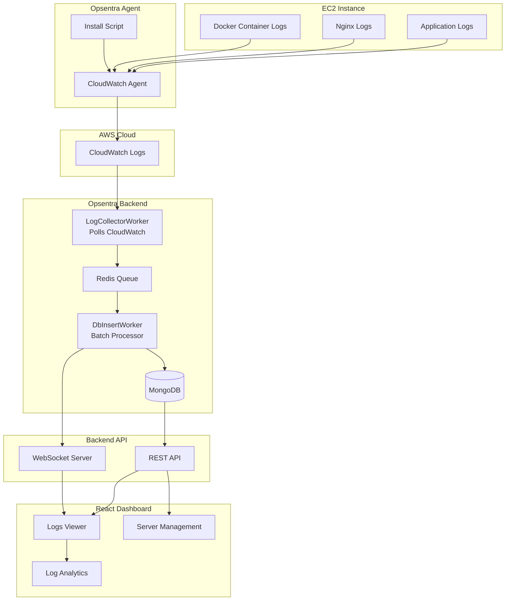

# Opsentra System Architecture



---

# What this diagram shows

The architecture visualization represents the **complete log pipeline**:

```

Server → Agent → CloudWatch → Workers → Redis → MongoDB → Dashboard

```

### Flow explanation

**1. Log Generation**

Servers produce logs:

- application logs
- nginx logs
- docker container logs

**2. Opsentra Agent**

The install script:

- installs CloudWatch agent
- configures log collection
- starts forwarding logs

**3. AWS CloudWatch**

CloudWatch stores logs reliably and acts as the **source of truth**.

**4. LogCollectorWorker**

Backend worker polls CloudWatch every **10 seconds**.

**5. Redis Queue**

Redis buffers log events to prevent ingestion bottlenecks.

**6. DbInsertWorker**

Processes logs in batches and inserts them into MongoDB.

**7. MongoDB**

Stores logs permanently with indexing.

**8. API Layer**

Backend exposes:

- REST APIs
- WebSocket streams

**9. React Dashboard**

Frontend displays:

- live logs
- server list
- log analytics

---

# How it will look in GitHub

GitHub will render the diagram like a **proper system architecture graph**, similar to what you see in:

- Stripe repos
- Kubernetes docs
- Hashicorp projects

This will make your repo look **much more production-grade**.

---

# Optional (Even Better)

If you want something **even more impressive**, we can also add:

### Infrastructure Architecture Diagram

```

User → Browser
→ React Dashboard
→ Node API
→ Redis
→ MongoDB
→ AWS STS
→ CloudWatch
→ EC2 Instances

```

### Log Flow Diagram

```

EC2 → Agent → CloudWatch → Worker → Redis → MongoDB → Dashboard

```

### DevOps Architecture Diagram

```

EC2 + Docker + Nginx
↓
CloudWatch Agent
↓
CloudWatch Logs
↓
Opsentra Workers
↓
Redis Queue
↓
MongoDB
↓
Frontend Dashboard

```