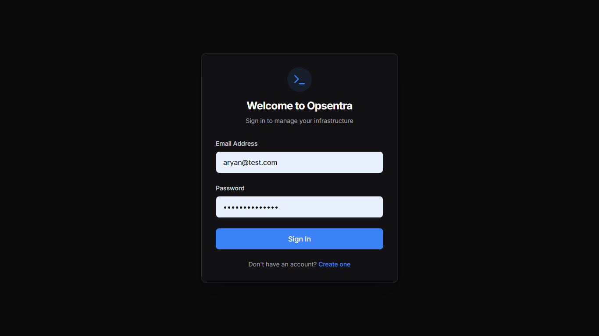
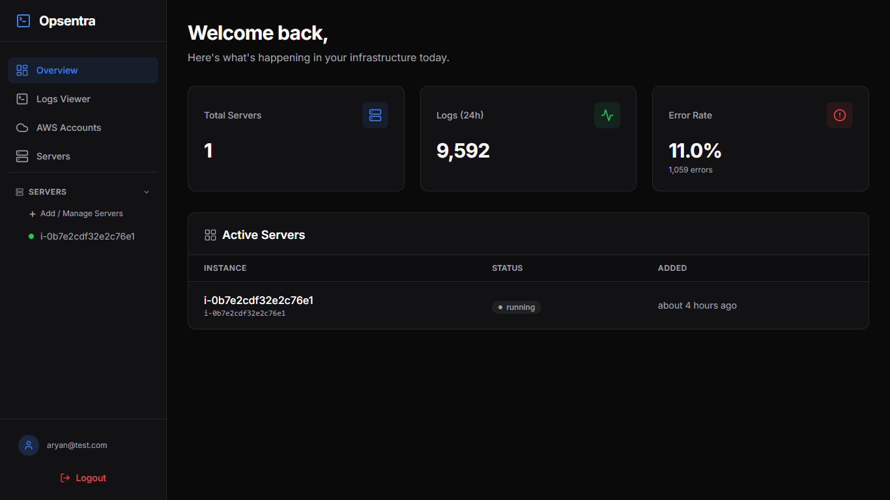
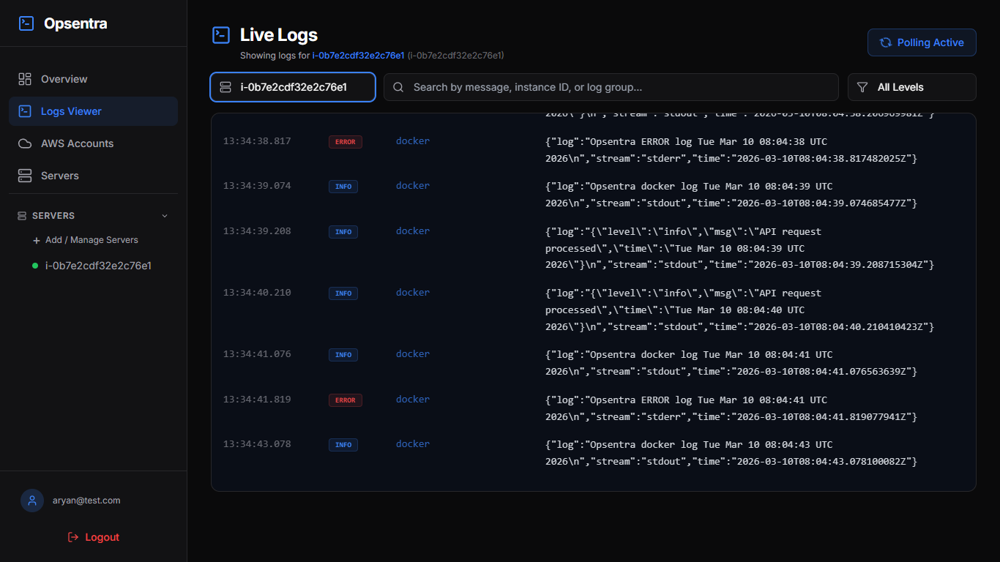
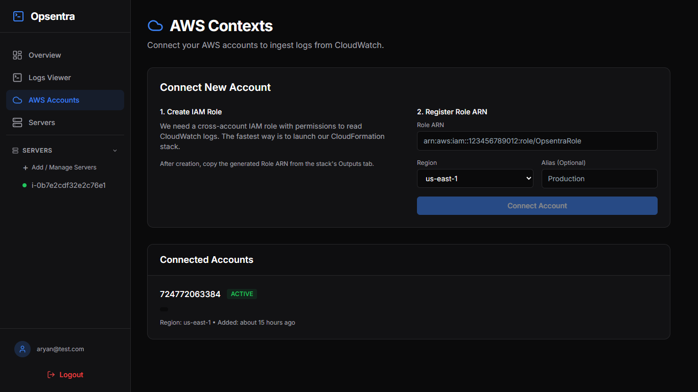
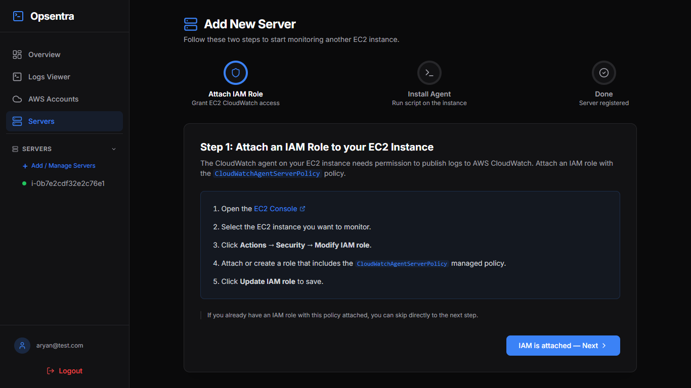
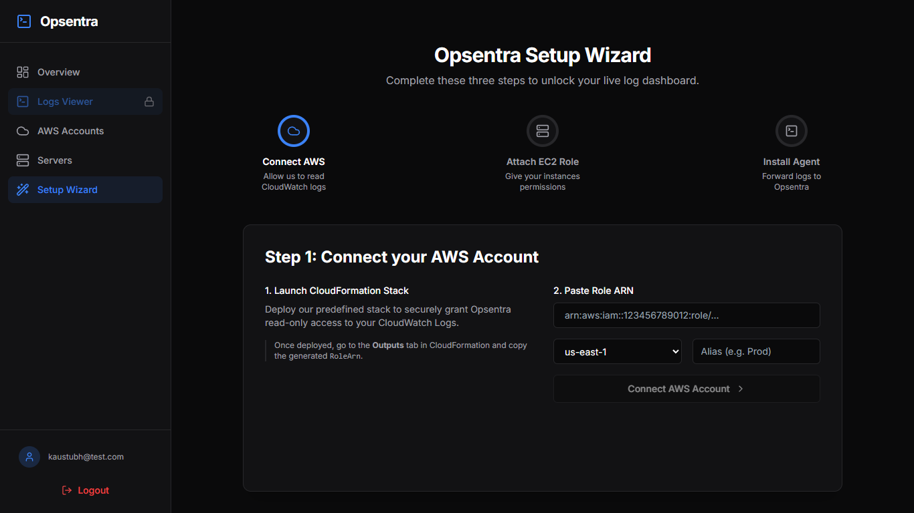

# Opsentra — Centralized Logging Platform

Opsentra is a **cloud log intelligence platform** that enables developers and teams to **monitor, analyze, and debug infrastructure logs in real time** without directly accessing AWS CloudWatch.

It automatically collects logs from EC2 instances, streams them through a scalable backend pipeline, and displays them in a **live dashboard with filtering, categorization, and search capabilities.**

The platform is designed to simplify operational debugging by turning distributed infrastructure logs into a **single unified observability interface**.

---

## Product Overview

Modern infrastructure produces massive amounts of logs across servers, containers, and services. Accessing and analyzing these logs typically requires navigating multiple AWS consoles and services.

Opsentra solves this by providing:

- Centralized log monitoring
- Live streaming of infrastructure logs
- Automatic log categorization
- Server-level filtering
- Simple one-command agent installation
- Secure AWS integration via IAM roles

Instead of opening CloudWatch, SSHing into servers, and manually searching logs, Opsentra provides a **single dashboard for observability.**

---

## Key Features

### Centralized Log Monitoring
Collect logs from multiple EC2 instances and view them in one unified dashboard.

### Live Log Streaming
Logs appear in real time with automatic polling and updates.

### Log Level Classification
Logs are automatically categorized as:

- INFO
- ERROR
- WARN
- DEBUG

### Server-Level Filtering
Quickly isolate logs from specific infrastructure instances.

### AWS Integration
Securely connect AWS accounts using IAM Role-based access.

### Agent-Based Log Collection
Install a lightweight agent on servers using a single command.

### Scalable Backend Pipeline
Logs flow through a queue-based ingestion pipeline using Redis and MongoDB.

---

## Screenshots

### Login



---

### Dashboard Overview



---

### Live Log Viewer



---

### AWS Integration



---

### Server Setup



---

### Setup Wizard



## Architecture Overview

```

EC2 Instance
│
│ CloudWatch Agent
▼
AWS CloudWatch Logs
│
│ (Opsentra polls via AWS STS AssumeRole)
▼
Backend Workers
│
├─ LogCollectorWorker → fetch CloudWatch logs
├─ Redis Queue
└─ DbInsertWorker → store logs in MongoDB
│
▼
Frontend Dashboard

```

---

## Tech Stack

### Backend
- Node.js
- Express.js
- MongoDB
- Redis
- AWS SDK v3
- WebSockets
- Winston logging

### Frontend
- React
- Vite
- Tailwind CSS
- React Router
- Axios

### Infrastructure
- AWS CloudWatch
- EC2
- IAM Roles
- CloudWatch Agent

---

## Getting Started

### Prerequisites

- Node.js ≥ 20
- MongoDB
- Redis
- AWS Account

---

### 1️⃣ Clone the repository

```

git clone [https://github.com/Aryankesharwani04/opsentra.git](https://github.com/Aryankesharwani04/opsentra.git)
cd opsentra

```

---

### 2️⃣ Setup Backend

```

cd opsentra
cp .env.example .env

```

Fill the environment variables.

```

npm install
npm run dev

```

Backend runs on:

```

[http://localhost:5000](http://localhost:5000)

```

---

### 3️⃣ Setup Frontend

```

cd ../frontend
npm install
npm run dev

```

Frontend runs on:

```

[http://localhost:5173](http://localhost:5173)

```

---

### 4️⃣ Connect AWS

Open:

```

[http://localhost:5173](http://localhost:5173)

```

Then follow the **Setup Wizard**:

1️⃣ Connect AWS account  
2️⃣ Attach IAM role to EC2  
3️⃣ Install Opsentra agent  

---

### 5️⃣ Install Agent on EC2

Run this command on your instance:

```

sudo curl -sSL [https://raw.githubusercontent.com/Aryankesharwani04/opsentra/upgradation/opsentra/agent/install.sh](https://raw.githubusercontent.com/Aryankesharwani04/opsentra/upgradation/opsentra/agent/install.sh) 
| sudo bash -s <workspace_id>

```

The agent will:

- Install CloudWatch agent
- Configure log forwarding
- Register instance with Opsentra
- Start log streaming

Logs will appear in the dashboard within **~30 seconds**.

---

## Security

Opsentra follows modern security practices:

- Password hashing using bcrypt
- JWT authentication
- Refresh tokens stored in HttpOnly cookies
- Rate limiting using Redis
- Secure AWS access via IAM roles
- No AWS credentials stored

---

## Future Roadmap

Planned improvements:

- AI log analysis agent
- Automated root cause detection
- Command suggestions for fixing errors
- Alerting system
- Kubernetes log support
- Slack / Discord notifications

The goal is to evolve Opsentra into a **full DevOps observability platform.**

---

## Documentation

Detailed technical documentation:

```

docs/ARCHITECTURE.md

```

---

## License

MIT License

```
⭐ If you like this project, consider starring the repo.
```